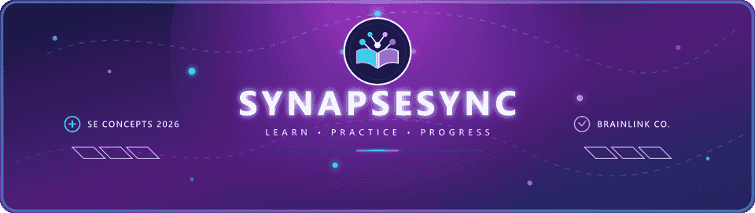
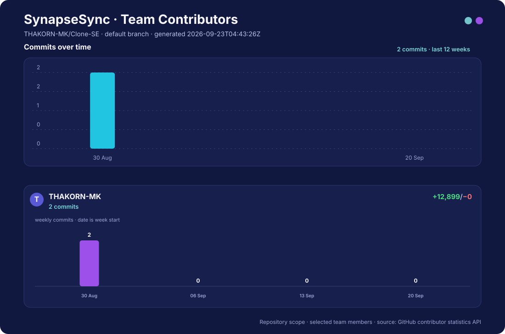

<div align="center">



</div>

<div align="center">

### เปลี่ยนจุดที่ยังไม่เข้าใจ ให้เป็นการเรียนรู้ที่ต่อเนื่อง

เว็บแอปพลิเคชันที่เชื่อมคำถาม คำอธิบาย แบบฝึกหัด และความก้าวหน้าของผู้เรียนไว้ใน flow เดียว

<br>

<code>Learning Web App</code>
<code>Lab 01–07</code>
<code>Docs-first</code>
<code>Academic Project</code>

<br><br>

<a href="#-project-overview"><kbd>OVERVIEW</kbd></a>
<a href="#-core-learning-flow"><kbd>LEARNING FLOW</kbd></a>
<a href="#-personas"><kbd>PERSONAS</kbd></a>
<a href="#-documentation-hub"><kbd>DOCUMENTATION</kbd></a>
<a href="#-getting-started"><kbd>GET STARTED</kbd></a>
<a href="#-team--brainlink-co"><kbd>TEAM</kbd></a>
<a href="#contribution-graph"><kbd>CONTRIBUTIONS</kbd></a>

</div>

---

## ✦ Project Overview

<div align="center">


</div>

<table>
<tr>
<td width="50%" valign="top">

### The Problem

เมื่อผู้เรียนติดขัดกับบทเรียน พวกเขามักต้องค้นหาคำอธิบายจากหลายแหล่ง ไม่กล้าถามซ้ำ และไม่รู้ว่าตัวเองเข้าใจจริงหรือเพียงแค่อ่านเฉลยแล้วรู้สึกว่าเข้าใจ

</td>
<td width="50%" valign="top">

### The Solution

SynapseSync ช่วยระบุจุดที่ยังไม่เข้าใจ อธิบายแนวคิดทีละขั้น สร้างโจทย์ที่เกี่ยวข้อง และบันทึกผลการฝึก เพื่อให้ผู้เรียนและผู้สอนใช้ข้อมูลนั้นวางแผนการเรียนรู้ต่อได้

</td>
</tr>
</table>

### Project at a Glance

| | |
|---|---|
| **Theme** | Tools for Modern Learners |
| **Primary User** | นักเรียนที่ต้องทบทวนและแก้จุดที่ไม่เข้าใจด้วยตนเอง |
| **Core Value** | ลดเวลาค้นหาคำอธิบายและเปลี่ยนความเข้าใจให้เป็นหลักฐานจากการฝึก |
| **Current Scope** | Lab 01–07: pragmatic commit, requirements, prototype, architecture, first container และ refactoring |
| **Project Status** | Lab 01–02 ผ่านแล้ว; Lab 04–07 verified; Docker image `v0.1.0` published |

> Lab 01–02 ปิดงานแล้ว ส่วน Prototype, Architecture, Docker build/run และ Lab 07 refactoring ผ่านการตรวจใน environment ปัจจุบัน

---

## ✦ Core Learning Flow

<div align="center">


</div>

<table>
<tr>
<td width="25%" align="center" valign="top">

### 01
**Ask**

ผู้เรียนส่งคำถามหรือเนื้อหาที่ไม่เข้าใจ

</td>
<td width="25%" align="center" valign="top">

### 02
**Clarify**

ระบบถามกลับเพื่อค้นหาจุดที่ติดขัดจริง

</td>
<td width="25%" align="center" valign="top">

### 03
**Practice**

ผู้เรียนรับคำอธิบายและฝึกโจทย์ที่เกี่ยวข้อง

</td>
<td width="25%" align="center" valign="top">

### 04
**Progress**

ระบบบันทึกผลและแสดงสิ่งที่ควรเรียนต่อ

</td>
</tr>
</table>

รายละเอียด narrative, edge cases และ Acceptance Criteria อยู่ใน [Main Scenario](./docs/requirements/main_scenario.md)

---

## ✦ Personas

| Persona | Role | Primary Goal | Usage Pattern |
|---|---|---|---|
| [ปันปัน](./docs/requirements/personas/student_learner.md) | Student Learner | เข้าใจบทเรียนและตรวจสอบความเข้าใจด้วยโจทย์ฝึก | หลายครั้งต่อสัปดาห์ |
| [ครูสมชาย](./docs/requirements/personas/teacher_mentor.md) | Teacher Mentor | ค้นหาหัวข้อและนักเรียนที่ต้องการความช่วยเหลือ | 2–3 ครั้งต่อสัปดาห์ |
| [พี่เอิร์ธ](./docs/requirements/personas/adult_learner.md) | Adult Learner | เรียนต่อเนื่องได้แม้ตารางงานไม่แน่นอน | 1–4 ครั้งต่อสัปดาห์ |
| [คุณแม่มล](./docs/requirements/personas/parent_guardian.md) | Supporting Persona | สนับสนุนผู้เรียนภายใต้ consent และ privacy | อ่านสรุปตามความจำเป็น |

> Lab 03 ใช้ Persona หลัก 3 คน ส่วนผู้ปกครองเป็น supporting research artifact จนกว่าทีมจะยืนยัน privacy และ consent flow

---

## ✦ Learning Ecosystem

<div align="center">


<sub>ระบบมีหน้าที่สนับสนุนการตัดสินใจของผู้เรียนและผู้สอน ไม่ใช่เฝ้าระวังหรือตัดสินผลการเรียนแทนมนุษย์</sub>

</div>

---

## ✦ Documentation Hub

<table>
<tr>
<td width="50%" valign="top">

### Product Foundation

- [Project Proposal](./docs/project-proposal.md) — Theme, value, scope, priorities and risks
- [Definition of Done](./docs/definition-of-done.md) — เกณฑ์ร่วมก่อนย้ายงานเป็น Done
- [AI Usage](./AI_USAGE.md) — เครื่องมือ AI ส่วนที่นำมาใช้ และวิธีตรวจสอบ
- [Lab 06 Evidence](./docs/evidence/lab06/README.md) — หลักฐาน build, health check และ Docker Hub
- [Lab 07 Refactoring Journal](./docs/refactoring-journal.md) — smell, refactor และ test-first evidence

</td>
<td width="50%" valign="top">

### Requirements

- [Persona Overview](./docs/requirements/personas.md)
- [Main Scenario and User Stories](./docs/requirements/main_scenario.md)
- [Software Requirements Specification](./docs/requirements/srs.md)
- [Measurable NFRs](./docs/requirements/nfr.md)

</td>
</tr>
<tr>
<td width="50%" valign="top">

### Prototype

- [Sprint 1 Entry Point](./prototypes/sprint1/index.html)
- [Prototype Workspace](./prototypes/sprint1/)
- [Prototype Guide and Test Evidence](./prototypes/sprint1/README.md)

Prototype เป็นงานสาธิตและยังไม่เชื่อมต่อ authentication หรือฐานข้อมูลจริง

</td>
<td width="50%" valign="top">

### Architecture

- [Architecture Overview](./docs/architecture/README.md)
- [Architecture Decision Records](./docs/architecture/adr/)
- [C4 Diagram Sources](./docs/architecture/diagrams/)
- [Team Reflections](./docs/reflections/) — บันทึก reflection ของสมาชิกทีม

Architecture Lab 05 ใช้ Modular Monolith เป็น implementation target โดย Lab 06 เริ่มพิสูจน์ deployable boundary ด้วย FastAPI first container

</td>
</tr>
</table>

---

## ✦ Getting Started

### Prerequisites

| Requirement | Used For |
|---|---|
| Git | Clone และทำงานร่วมกันใน repository |
| Modern Web Browser | เปิด Sprint 1 prototype |
| Python 3.12+ | รัน FastAPI service และ automated tests |
| Docker Desktop/Engine | Build และ run `synapsesync-api:v0.1.0` |

### 1. Clone the Repository

```bash
git clone https://github.com/Software-Engineering-Concepts-2026/se-sec2-team-06.git
cd se-sec2-team-06
```

### 2. Open the Sprint 1 Prototype

เปิดไฟล์ต่อไปนี้ใน browser:

```text
prototypes/sprint1/index.html
```

สามารถใช้ static web server เช่น VS Code Live Server เพื่อให้ navigation ระหว่างหน้าทำงานใกล้เคียงสภาพแวดล้อมจริง

รายละเอียด flow, module และข้อจำกัดอยู่ใน [Prototype Guide](./prototypes/sprint1/README.md)

### 3. Run the FastAPI Service

```bash
python -m venv .venv
.venv\Scripts\activate
pip install -r services/api/requirements-dev.txt
cd services/api
uvicorn app.main:app --host 127.0.0.1 --port 8000
```

Health endpoint: `http://127.0.0.1:8000/health`

API documentation: `http://127.0.0.1:8000/docs`

### 4. Run Automated Checks

จาก repository root หลังติดตั้ง dependencies แล้ว:

```bash
pytest services/api/tests -q
node --test prototypes/sprint1/tests/*.test.cjs
```

Browser tests ต้องใช้ Playwright และ Chrome ตามรายละเอียดใน [Prototype Guide](./prototypes/sprint1/README.md)

### 5. Build the First Container

```bash
docker build -t synapsesync-api:v0.1.0 .
docker run --rm -p 8000:8000 synapsesync-api:v0.1.0
```

รายละเอียด image, security choices และ Container vs VM trade-off อยู่ใน [`docker/README.md`](./docker/README.md)

### 6. Pull the Verified Registry Image

```bash
docker pull thakornj/synapsesync-api:v0.1.0
```

ดู tag ล่าสุดได้ที่ [Docker Hub](https://hub.docker.com/r/thakornj/synapsesync-api/tags) และดูภาพหลักฐานใน [Lab 06 Evidence](./docs/evidence/lab06/README.md)

---

## ✦ Team — Brainlink Co.

<div align="center">

| Student ID | Member | GitHub |
|---|---|---|
| 67026023 | ฐากร ใจพล | [@THAKORN-MK](https://github.com/THAKORN-MK) |
| 67026012 | ไชยวัฒน์ แซ่ว้าง | [@Chaiwat2005](https://github.com/Chaiwat2005) |
| 67026146 | สุวิชาดา วงพีระ | [@67026146](https://github.com/67026146) |

</div>

---

<a id="contribution-graph"></a>

## Cᴏɴᴛʀɪʙᴜᴛɪᴏɴ Gʀᴀᴘʜ

กราฟนี้แสดง **commit activity ของ repository `Software-Engineering-Concepts-2026/se-sec2-team-06` เท่านั้น** โดยอ่านข้อมูลจาก GitHub repository contributor statistics บน default branch และคัดเฉพาะสมาชิกทีม 3 คนด้านล่าง ไม่ใช่กิจกรรมรวมจาก repository อื่นของสมาชิก

<div align="center">

<a href="https://github.com/Software-Engineering-Concepts-2026/se-sec2-team-06/graphs/contributors">
  
</a>

<br>

<sub>คลิกกราฟเพื่อดูข้อมูลล่าสุดจาก GitHub Insights · กราฟใน README จะอัปเดตโดย GitHub Actions</sub>
<br>
<sub>การ์ดของสมาชิกแสดงวันที่เริ่มต้นของแต่ละสัปดาห์และจำนวน commit ของช่วงนั้น ตามรูปแบบสถิติ Contributors ของ GitHub</sub>

</div>

| สมาชิกทีม | GitHub |
|---|---|
| ฐากร ใจพล | [@THAKORN-MK](https://github.com/THAKORN-MK) |
| ไชยวัฒน์ แซ่ว้าง | [@Chaiwat2005](https://github.com/Chaiwat2005) |
| สุวิชาดา วงพีระ | [@67026146](https://github.com/67026146) |

> สถิติของ GitHub อาจใช้เวลาประมวลผลหลังมีการเปลี่ยนแปลงประวัติ commit กราฟนี้เป็นหลักฐานกิจกรรมใน repository ไม่ใช่ตัววัดคุณภาพหรือปริมาณงานทั้งหมดของสมาชิก

---

## ✦ Team Workflow

<details>
<summary><strong>Meeting and Progress Tracking</strong></summary>

<br>

| การประชุม | ความถี่ | ระยะเวลา | วัตถุประสงค์ |
|---|---|---:|---|
| Sprint Planning | ต้นสัปดาห์ | 30–45 นาที | วางแผนเป้าหมายและแบ่งหน้าที่ |
| Progress Check-in | 2–3 ครั้งต่อสัปดาห์ผ่าน Discord | 10–15 นาที | อัปเดตความคืบหน้าและ blocker |
| Sprint Review / Demo | สิ้นสัปดาห์ | 20–30 นาที | สาธิตผลงานและตรวจความพร้อม |
| Retrospective | หลัง Sprint Review | 15–20 นาที | สรุปปัญหาและแนวทางปรับปรุง |

- การประชุมส่วนใหญ่ดำเนินการผ่าน **Discord**
- หากไม่มีประเด็นสำคัญ สามารถอัปเดตสถานะผ่านข้อความได้
- สมาชิกควรเข้าร่วมการประชุมหลักหรือแจ้งล่วงหน้าหากไม่สะดวก

</details>

<details>
<summary><strong>Team Communication</strong></summary>

<br>

ทีมใช้ **Discord** เป็นช่องทางหลักสำหรับเรื่องงาน และใช้ **Instagram** เป็นช่องทางสำรองสำหรับการติดต่อทั่วไป

- แยกการสนทนาตามหัวข้อเพื่อให้ค้นหาข้อมูลย้อนหลังได้
- แจ้งข้อจำกัดด้านเวลาและ blocker โดยเร็ว
- กรณีเร่งด่วน ให้ติดต่อผู้เกี่ยวข้องโดยตรงผ่าน Discord
- เป้าหมายคือให้สมาชิกเห็นข้อมูลชุดเดียวกันและตัดสินใจจากหลักฐาน

</details>

<details>
<summary><strong>Git and Review Workflow</strong></summary>

<br>

| Branch | Purpose | Rule |
|---|---|---|
| `main` | งานที่ผ่านการตรวจและพร้อมส่งมอบ | ห้าม push หรือ commit ตรง |
| `develop` | Integration branch สำหรับรวม feature | Merge หลังผ่านการตรวจ |
| `feature/<feature-name>` | งานเฉพาะ feature หรือ deliverable | สร้างจาก branch ฐานที่ทีมตกลง |

ใช้ Conventional Commits:

```text
feat: add login validation
fix: resolve empty question submission
docs: update requirements traceability
```

Pull Request ต้องมี reviewer อย่างน้อย 1 คน, checks ที่เกี่ยวข้องต้องผ่าน, ข้อคิดเห็นต้องได้รับการแก้ไข และผู้พัฒนาไม่ approve งานของตนเอง

</details>

<details>
<summary><strong>Team Decision Process</strong></summary>

<br>

1. ระบุทางเลือกและข้อจำกัดให้ชัดเจน
2. เปรียบเทียบข้อดี ข้อเสีย และผลกระทบ
3. เปิดให้สมาชิกแสดงความคิดเห็น
4. บันทึกข้อสรุปและเหตุผลเมื่อเป็นการตัดสินใจสำคัญ
5. ปรับ backlog และ artifacts ที่เกี่ยวข้องให้สอดคล้องกัน

การตัดสินใจด้านสถาปัตยกรรมควรถูกบันทึกเป็น ADR เพื่อให้ตรวจสอบย้อนหลังได้

</details>

---

## ✦ Project Status and Boundaries

| Area | Status | Notes |
|---|---|---|
| Lab 01 — First Pragmatic Commit | ✅ เสร็จแล้ว | Initial repository structure, commit convention และ team setup อยู่ในประวัติ Git |
| Lab 02 — Sprint Zero | ✅ เสร็จแล้ว | Project Board, Issues, labels, milestones และ Insights ตรวจครบแล้วบน GitHub |
| Lab 04 — Prototype | ✅ เสร็จแล้ว | Shared UI และ browser regression tests ผ่านใน environment ปัจจุบัน |
| Lab 05 — Architecture | ✅ เสร็จแล้ว | Mermaid C4 render ผ่าน และเลือก Modular Monolith ผ่าน ADR-0001 |
| Lab 06 — First Container | ✅ เสร็จแล้ว | Docker build/run, `HEALTHCHECK`, `/health` และ Docker Hub image `thakornj/synapsesync-api:v0.1.0` ผ่าน |
| Lab 07 — Refactoring Milestone 1 | ✅ เสร็จแล้ว | แยก `renderQuestion()` เป็น view model และ rendering helpers พร้อม test-first evidence |

### Product Boundaries

- AI ไม่ตัดสินคะแนนหรือผลการเรียนอย่างเป็นทางการ
- คำอธิบายจาก AI อาจผิดได้และต้องเปิดทางให้ตรวจสอบหรือรายงานปัญหา
- ระบบไม่เปิดเผยข้อมูลผู้เรียนแก่บุคคลอื่นโดยไม่มี consent และ authorization
- ทีมจะไม่เพิ่ม feature นอก MoSCoW scope โดยไม่มีการตัดสินใจร่วมกัน

---

<div align="center">

### Built for learning, reviewed with evidence.

โครงการนี้จัดทำเพื่อการเรียนรู้ในรายวิชา **Software Engineering Concepts**<br>
พัฒนาโดยทีม **Brainlink Co.**

</div>
# Clone-SE
# Clone-SE
