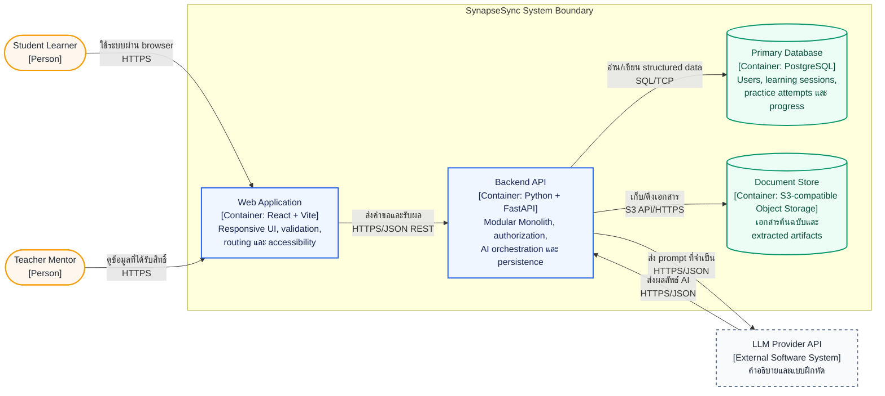

# C4 Level 2 — Container

> **System:** SynapseSync
> **Pattern:** Modular Monolith
> **Diagram scope:** MVP target containers and their runtime relationships

## Purpose

แผนภาพระดับ Container ขยายภายใน SynapseSync เพื่อแสดงหน่วยที่ทำงานหรือจัดเก็บข้อมูลแยกกัน เทคโนโลยีของแต่ละหน่วย และ protocol ที่ใช้สื่อสาร โดย Backend API ยังคง deploy เป็นหน่วยเดียวและ business modules ทำงานผ่าน in-process interfaces

## Container Diagram

## Container Responsibilities

| Container | Technology | Responsibility | Depends On |
|---|---|---|---|
| Web Application | React + Vite | แสดง UI, navigation, client-side validation, accessible feedback และเก็บ state ชั่วคราวของ flow | Backend API |
| Backend API | Python 3.11+ + FastAPI | Authentication/authorization, business rules, AI orchestration, document metadata และ transaction boundary | PostgreSQL, Object Storage, LLM Provider |
| Primary Database | PostgreSQL 15+ | เก็บ users, authorization relationships, questions, practice sets, attempts และ progress records | Backend API เป็นผู้เข้าถึงเพียงจุดเดียว |
| Document Store | S3-compatible Object Storage | เก็บไฟล์ binary และ extracted artifact; PostgreSQL เก็บ object key และ metadata | Backend API เป็นผู้เข้าถึงเพียงจุดเดียว |

## Backend Module Boundaries

Backend API เป็น deployable unit เดียว แต่แบ่ง source modules ตาม business capability:

| Module | Responsibility | May Access |
|---|---|---|
| Authentication | สมัคร เข้าสู่ระบบ password hashing และ identity | User/credential tables |
| Learning Assistant | รับคำถาม ขอข้อมูลเพิ่ม เรียก LLM และตรวจ response | Learning-session tables, LLM adapter |
| Practice/Quiz | สร้างชุดฝึก รับคำตอบ และคำนวณผล | Practice/question/attempt tables |
| Progress | สรุปผลการฝึกสำหรับผู้เรียนและผู้สอนตามสิทธิ์ | Attempt/progress read models |
| Document Context | ตรวจ metadata ของไฟล์ เก็บ object key และเตรียมข้อความประกอบ prompt | Document tables, Object Storage |

Module ต้องไม่เข้าถึง storage implementation ของ module อื่นโดยตรง การแลกข้อมูลข้าม module ใช้ service interface ภายใน process เพื่อให้สามารถแยกออกในอนาคตได้โดยไม่เปลี่ยน consumer ทุกจุด

## Main Data Flows

### Ask–Explain–Practice–Record

1. Student ส่งคำถามผ่าน Web Application
2. Web Application ส่ง HTTPS/JSON request ไป Backend API
3. Learning Assistant ตรวจ input และเรียก LLM Provider ผ่าน provider adapter
4. Practice/Quiz สร้างและส่งแบบฝึกหัดให้ Web Application
5. เมื่อผู้เรียนตอบ Backend บันทึก attempt ใน PostgreSQL ภายใน transaction
6. Progress อ่านผลล่าสุดเพื่อแสดงให้ Student หรือ Teacher ตาม authorization

### Document Context

1. Web Application ส่งไฟล์ไป Backend API โดยไม่ติดต่อ Object Storage โดยตรง
2. Document Context ตรวจชนิด ขนาด และชื่อไฟล์ แล้วสร้าง object key ที่ไม่เปิดเผยชื่อจริง
3. Backend เก็บไฟล์ผ่าน S3 API/HTTPS
4. เมื่อเก็บไฟล์สำเร็จจึงบันทึก object key และ metadata ใน PostgreSQL
5. หากขั้นตอนใดล้มเหลว ระบบไม่สร้าง metadata ที่ชี้ไปยัง object ที่ไม่มีอยู่

## Deployment View

- Web Application เป็น static assets ที่ deploy ผ่าน Vercel หรือ static hosting ที่เทียบเท่า
- Backend API สร้างเป็น Docker image หนึ่งชุดและ deploy ผ่าน Render หรือ container platform ที่เทียบเท่า
- PostgreSQL และ Object Storage ใช้ managed service เพื่อไม่เพิ่มภาระดูแลระบบในหนึ่งภาคการศึกษา
- Deployment target เป็นเป้าหมายสำหรับ MVP; Prototype ปัจจุบันยังเป็น HTML/CSS/JavaScript แบบ client-side และไม่มี backend จริง

## NFR Mapping

| NFR | Architectural Response |
|---|---|
| `NFR-PERF-01` | Vite สร้าง static assets; Web Application แยกจาก AI processing |
| `NFR-PERF-02` | Backend endpoint ที่ไม่เรียก LLM ใช้ FastAPI และ PostgreSQL connection pooling |
| `NFR-SEC-01` | Authentication module hash password; Web Application ไม่มีสิทธิ์อ่านฐานข้อมูล |
| `NFR-SEC-02` | Authorization อยู่ที่ Backend ทุก endpoint ที่เกี่ยวกับข้อมูลผู้เรียน |
| `NFR-AVL-01` | LLM adapter มี timeout/error mapping และไม่ทำให้ core data flow สูญหาย |
| `NFR-MNT-01` | Capability modules และ API contract ลด coupling พร้อมรองรับ automated tests |

## Boundaries and Future Evolution

- LMS และ Notification Service เป็น future options ไม่ใช่ dependency ของ MVP
- Microservices จะพิจารณาเมื่อมี module ที่ต้อง scale/deploy แยกอย่างวัดผลได้ มี owner ชัดเจน และทีมมี monitoring/operations พร้อม
- ดูเหตุผลของ pattern ใน [ADR-0001 — Modular Monolith](./adr/0001-modular-monolith.md)

## Related Artifacts

- [C4 Level 1 — System Context](./c4-context.md)
- [Technology Stack](./tech_stack.md)
- [ADR-0001 — Modular Monolith](./adr/0001-modular-monolith.md)
- [Non-Functional Requirements](../requirements/nfr.md)
