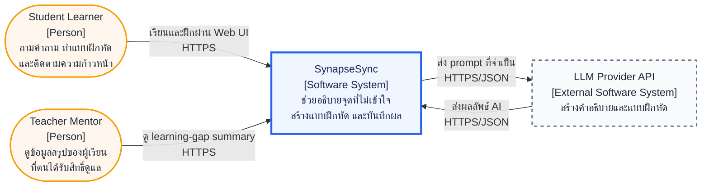

# C4 Level 1 — System Context

> **System:** SynapseSync
> **Architecture scope:** MVP target architecture
> **Diagram notation:** C4 semantics rendered with Mermaid

## Purpose

แผนภาพระดับ Context แสดงว่าใครใช้ SynapseSync และระบบต้องพึ่งพาบริการภายนอกใด โดยมอง SynapseSync เป็น Software System หนึ่งก้อน ยังไม่แสดงรายละเอียดภายในหรือเทคโนโลยีที่ใช้ deploy

## System Context Diagram

## Elements

| Element | C4 Type | Responsibility |
|---|---|---|
| Student Learner | Person | สมัคร/เข้าสู่ระบบ ส่งคำถาม ทำแบบฝึกหัด และดูผลการฝึกของตนเอง |
| Teacher Mentor | Person | ดูสรุปหัวข้อที่ผู้เรียนในความรับผิดชอบติดขัดและเวลาที่ข้อมูลอัปเดต |
| SynapseSync | Software System | ประสาน flow ถาม–อธิบาย–ฝึก–บันทึกผล และควบคุมสิทธิ์เข้าถึงข้อมูล |
| LLM Provider API | External Software System | ประมวลผล prompt เพื่อเสนอคำอธิบายและโจทย์ฝึก ระบบต้องตรวจผลก่อนนำไปใช้ |

## Key Relationships

- ผู้ใช้เข้าถึง SynapseSync ผ่าน HTTPS เท่านั้น และไม่ติดต่อฐานข้อมูลหรือ LLM Provider โดยตรง
- SynapseSync ส่งเฉพาะข้อมูลที่จำเป็นต่อคำขอไปยัง LLM Provider และไม่ส่ง credential ของผู้ใช้
- หาก LLM Provider ไม่พร้อม SynapseSync ต้องเก็บข้อความของผู้ใช้และแสดงสถานะผิดพลาดโดยไม่ทำให้หน้าใช้งานค้าง
- Teacher Mentor เห็นเฉพาะข้อมูลของผู้เรียนที่ผ่าน authorization ตามความสัมพันธ์การดูแล

## Requirement Traceability

| Architecture Element/Relationship | Requirements Supported |
|---|---|
| Student Learner → SynapseSync | `FR-AUTH-01`, `FR-AUTH-02`, `FR-ASK-01`, `FR-PRAC-01`, `FR-PROG-01`, `FR-PROG-02` |
| Teacher Mentor → SynapseSync | `FR-DASH-01`, `NFR-SEC-02` |
| SynapseSync ↔ LLM Provider API | `FR-ASK-01`, `FR-ASK-02`, `FR-PRAC-01`, `NFR-AVL-01` |
| Web-based access | `NFR-PERF-01`, `NFR-USE-01`, `NFR-ACC-01` |

## Scope Boundaries

- University LMS integration ไม่อยู่ใน MVP เพราะต้องรอสิทธิ์ API และถูกระบุเป็น `Won't Have This Term`
- External Notification Service ยังไม่อยู่ใน Context ปัจจุบัน เพราะ reminder เป็น `Could Have`
- Parent-facing data sharing จะเพิ่มได้เมื่อทีมกำหนด consent และ authorization flow แล้วเท่านั้น
- Object Storage เป็น infrastructure ที่ทีมควบคุมและจะแสดงใน [C4 Level 2 — Container](./c4-container.md) ไม่ใช่ external business system ใน Level 1

## Related Artifacts

- [C4 Level 2 — Container](./c4-container.md)
- [Technology Stack](./tech_stack.md)
- [Project Proposal](../project-proposal.md)
- [Software Requirements Specification](../requirements/srs.md)
- [Non-Functional Requirements](../requirements/nfr.md)
