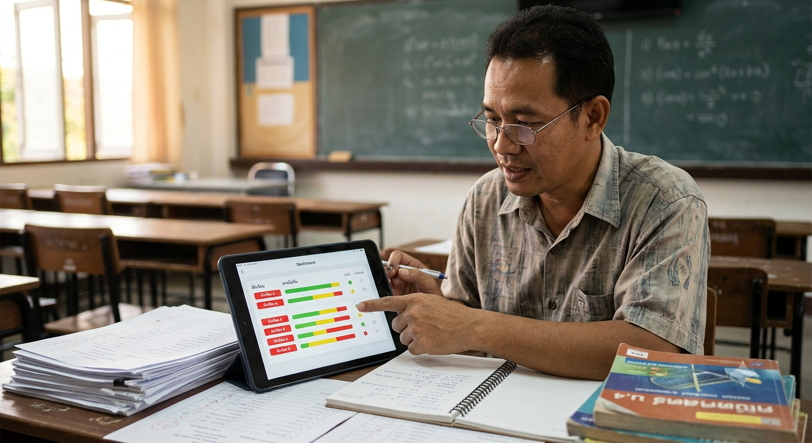

# Personas — SynapseSync

เอกสารนี้กำหนด Persona หลัก 3 คนของ SynapseSync โดยทุก Persona เป็น archetype ที่ grounded จากบริบทการเรียนรู้จริง ไม่ใช่ข้อมูลส่วนบุคคลของบุคคลใดบุคคลหนึ่ง

## Persona 1 — ปันปัน: Student Learner

- **Personalization:** นักเรียนชั้น ม.5 อายุ 16 ปี เรียนสายวิทย์–คณิต ใช้สมาร์ทโฟนเป็นอุปกรณ์หลัก และกำลังเตรียมสอบเข้ามหาวิทยาลัย
- **Job:** เรียนในโรงเรียน ทำการบ้าน และทบทวนบทเรียนด้วยตนเองนอกเวลาเรียน
- **Education:** มีพื้นฐานฟิสิกส์และคณิตศาสตร์ระดับมัธยมปลาย แต่ต้องการคำอธิบายเพิ่มเติมเมื่อเจอโจทย์ที่ซับซ้อน
- **Relevance:** เป็นผู้ใช้หลักของ flow ถามคำถาม รับคำอธิบาย ฝึกโจทย์ และติดตามความเข้าใจของตนเอง
- **Frequency of use:** ใช้หลายครั้งต่อสัปดาห์ โดยเฉพาะช่วงทำการบ้านและก่อนสอบ

**Grounding:** บริบทโมเมนตัมและการชนจาก Main Scenario เป็นตัวแทนของปัญหาที่ผู้เรียนต้องค้นหาคำอธิบายจากหลายแหล่งก่อนใช้ระบบ

## Persona 2 — ครูสมชาย: Teacher Mentor

- **Personalization:** ครูมัธยมอายุ 42 ปี มีประสบการณ์สอน 15 ปี และดูแลนักเรียนมากกว่า 120 คน
- **Job:** สอน ติดตามผลการฝึก และจัดสรรเวลาช่วยเหลือนักเรียนที่มีปัญหา
- **Education:** มีความรู้ด้านการสอนคณิตศาสตร์และคุ้นเคยกับเครื่องมืออย่าง Google Classroom แต่ไม่ต้องการระบบที่ซับซ้อน
- **Relevance:** ต้องการข้อมูลสรุปว่าหัวข้อใดและกลุ่มใดต้องการความช่วยเหลือ โดยไม่ต้องตรวจข้อมูลของนักเรียนทีละคน
- **Frequency of use:** เปิดดู Dashboard สัปดาห์ละ 2–3 ครั้งและก่อนวางแผนสอนเสริม

**Grounding:** Scenario ด้าน Dashboard และการตรวจสิทธิ์สะท้อนการใช้งานของครูที่ต้องใช้ข้อมูลเท่าที่จำเป็นต่อการช่วยเหลือ

## Persona 3 — พี่เอิร์ธ: Adult Learner

- **Personalization:** ผู้เรียนวัยทำงานอายุ 29 ปี ทำงานเป็นกะและมีเวลาเรียนไม่แน่นอน
- **Job:** ทำงานฝ่ายผลิตพร้อมเรียนคอร์สออนไลน์เพื่อเตรียมเปลี่ยนสายงาน
- **Education:** เรียนรู้ทักษะด้านข้อมูลและดิจิทัลด้วยตนเองนอกเวลางาน
- **Relevance:** ต้องการการทบทวนที่ยืดหยุ่น การเตือน และภาพความก้าวหน้าที่ช่วยให้กลับมาเรียนต่อได้
- **Frequency of use:** ใช้ตามตารางกะประมาณ 1–4 ครั้งต่อสัปดาห์ และอาจเว้นช่วงเมื่อภาระงานสูง

**Grounding:** User Stories เรื่อง Reminder และ Progress สะท้อนข้อจำกัดด้านเวลาของผู้เรียนที่ไม่ได้เปิดแอปทุกวัน

## Supporting Research Artifact

ผู้ปกครองเป็น supporting research artifact สำหรับศึกษาความต้องการด้าน consent และการแจ้งเตือน แต่ยังไม่รวมเป็น Persona หลักของ Lab 3 เพื่อควบคุม MVP และป้องกัน feature creep

## Persona Quality Check

| Persona | Personalization | Job | Education | Relevance | Frequency |
|---|---|---|---|---|---|
| ปันปัน | ✓ | ✓ | ✓ | ✓ | ✓ |
| ครูสมชาย | ✓ | ✓ | ✓ | ✓ | ✓ |
| พี่เอิร์ธ | ✓ | ✓ | ✓ | ✓ | ✓ |

## Traceability

- Scenarios: [`scenarios.md`](./scenarios.md)
- User Stories: [`user-stories.md`](./user-stories.md)
- Non-functional Requirements: [`nfr.md`](./nfr.md)
