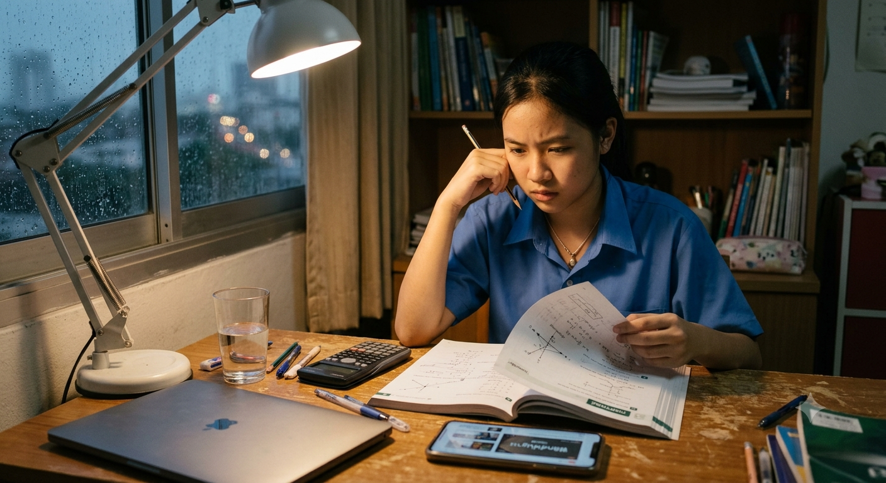

# Persona: ปันปัน (ปาริชาติ)

> "บางทีอ่านหนังสือคนเดียวแล้วงงมาก อยากมีคนอธิบายซ้ำแบบไม่ต้องอายที่ถามซ้ำๆ"

---

### Bio & Background

ปันปัน อายุ 16 ปี นักเรียนชั้น ม.5 สายวิทย์-คณิต ที่โรงเรียนรัฐบาลขนาดใหญ่ในกรุงเทพฯ เธอเรียนเก่งปานกลาง ตั้งใจเรียนแต่มักตามเนื้อหาในห้องไม่ทัน โดยเฉพาะวิชาฟิสิกส์และคณิตศาสตร์ ครอบครัวไม่มีงบพอสำหรับติวเตอร์ส่วนตัวราคาแพง เธอจึงพึ่งพาการเรียนรู้ด้วยตนเองผ่านคลิปยูทูบและแอปต่างๆ

### Goals & Motivations

อยากเข้าใจเนื้อหาให้ทันเพื่อนในห้อง อยากสอบเข้าคณะวิศวกรรมศาสตร์ให้ได้ และต้องการพื้นที่ที่ถามคำถาม "โง่ๆ" ซ้ำได้โดยไม่รู้สึกอาย

### Frustrations & Pain Points

เวลาไม่เข้าใจโจทย์ ไม่รู้จะถามใคร ครูสอนเร็วเกินไป เพื่อนก็ไม่เข้าใจเหมือนกัน หาคลิปอธิบายในยูทูบก็ใช้เวลานานกว่าจะเจอคลิปที่ตรงกับสิ่งที่ไม่เข้าใจจริงๆ

### Tech-savviness & Habits

ใช้สมาร์ทโฟนเป็นหลัก คุ้นเคยกับ TikTok, Instagram, และแอปแชท ใช้แล็ปท็อปเฉพาะตอนทำการบ้านหรือส่งงาน เปิดรับเทคโนโลยีใหม่ๆ ง่าย โดยเฉพาะถ้าใช้งานง่ายและตอบสนองเร็ว
